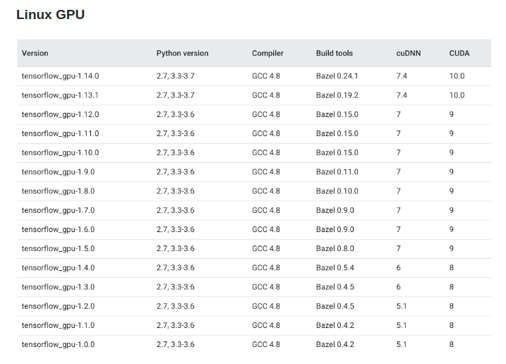

### Source kitti dataset + VGG base
Dataset + VGG url: https://drive.google.com/file/d/1je7YaKnb3dhEQ33tvCeOeqt6vy2M_Ubv/view?usp=sharing

Download and extract to root directory 

### Environment descriptions
* Tensorflow-gpu 1.13.1
* Cuda 10.0
* CuDNN 7.4.1

### Installation guide
https://gist.github.com/bogdan-kulynych/f64eb148eeef9696c70d485a76e42c3a
* Install specific cuda version
```bash
sudo apt install -y cuda-10-0    
```
* Search for available version of libcudnn7 package:
```bash 
sudo apt-cache policy libcudnn7
```
* Check compatible version tensorflow-gpu

